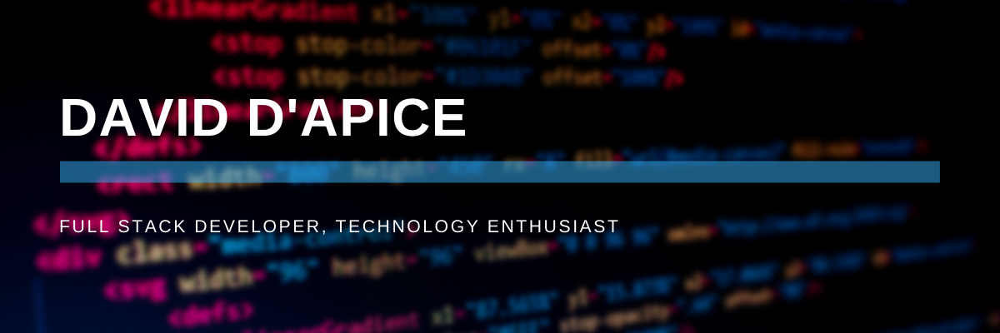

<!--
**scrimmie/scrimmie** is a ✨ _special_ ✨ repository because its `README.md` (this file) appears on your GitHub profile.

Here are some ideas to get you started:

- 🔭 I’m currently working on ...
- 🌱 I’m currently learning ...
- 👯 I’m looking to collaborate on ...
- 🤔 I’m looking for help with ...
- 💬 Ask me about ...
- 📫 How to reach me: ...
- 😄 Pronouns: ...
- ⚡ Fun fact: ...
-->

# David Dapice :computer: 
#### *I am a driven, passionate technologist combining logic, interpersonal skills, and a team-player orientation. I have 2+ years of experience working in both startups and established technology companies, developing in agile work environments using industry standard technologies and workflows. I am inspired by technology, and actively follow trends in web technology, incorporating them into projects to optimize them whenever and wherever possible. My current personal interests/hobbies include blockchain/smart contracts, video games, music, film, and IOT.*

##### I am a computer engineer, always learning, and tinkering with new projects. Welcome to my GitHub where I post some of the fun projects I am working on. Please contact me with any questions you may have.

### Contact Info:
  
  

